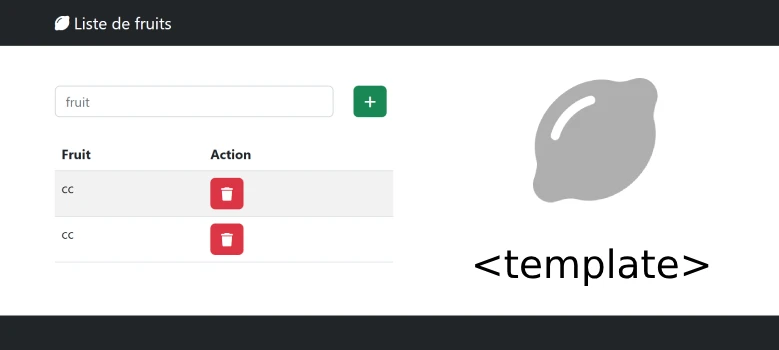

# Correction TP4
  

 
  
## partie HTML
```html
<!-- [...] -->
<table class="table table-striped mt-4">
    <thead>
    <tr>
        <th>Fruit</th>
        <th>Action</th>
    </tr>
    </thead>
    <!-- zone de dépot -->
    <tbody id="myTbody"></tbody>
</table>
<!-- [...] -->
    <template id="templateTr">
      <tr>
        <td></td>
        <td>
          <button class="btn btn-danger">
            <i class="fa fa-trash"></i>
          </button>
        </td>
      </tr>
    </template>
    <script src="partie1.js" defer></script>
  </body>
```

## partie 1 JS
```js
document.getElementById("btnAjouter").onclick = () => {
    let fruit = document.getElementById('fruit').value;
    document.getElementById('fruit').value=''; // vider input
    // selecteur sur le tableau
    const tbody = document.getElementById("myTbody");
    // selecteur sur le template
    const template = document.getElementById('templateTr');
    // cloner le template
    const clone = template.content.cloneNode(true);
    let td = clone.querySelector("td");
        td.textContent = fruit;
    let btn = clone.querySelector("button");
    btn.onclick =(evt)=>{
            // parentElement 2 fois
            // td puis tr
            if(confirm("Voulez-vous enlever : "+fruit+" ?")){
                evt.target.closest("tr").remove();
            }
            //evt.target.parentElement.parentElement.parentElement.remove();
        }
    // ajouter le tr cloner ds le tableau html
    tbody.appendChild(clone);  
  };
```
## partie 2 JS
```js
let fruits = [];
const afficher = () => {
    const tbody = document.getElementById("myTbody");
    tbody.innerHTML='';
  for (let fruit of fruits) {
    console.log(fruits);
    // selecteur sur le tableau
   
    // selecteur sur le template
    const template = document.getElementById("templateTr");
    // cloner le template
    const clone = template.content.cloneNode(true);
    let td = clone.querySelector("td");
    td.textContent = fruit;
    let btn = clone.querySelector("button");
    btn.onclick = (event) => {
      if (confirm("Voulez-vous enlever : " + fruit + " ?")) {
       const indice =  event.target.closest("tr").rowIndex -1;
       fruits.splice(indice,1);
       afficher();
      }
    };
    // ajouter le tr cloner ds le tableau html
    tbody.appendChild(clone);
  }
};

document.getElementById("btnAjouter").onclick = () => {
  let fruit = document.getElementById("fruit").value;
  document.getElementById("fruit").value = ""; // vider input
  fruits.push(fruit);
  afficher();

};

```